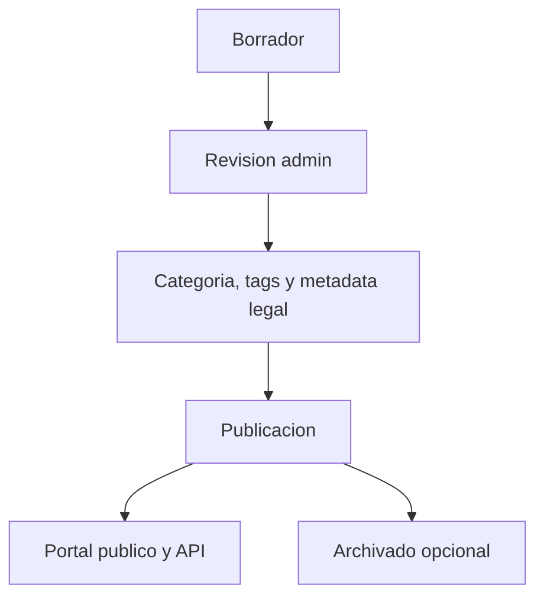

# Flujo de noticias legales

## Flujo editorial

## Creacion manual

1. Admin ingresa a `/admin/news/create`.
2. Completa titulo, slug, resumen y cuerpo.
3. Asigna categoria y tags.
4. Completa campos legales si aplican.
5. Guarda como `draft` o `published`.

## Publicacion

Solo las noticias `published` aparecen en:

- `GET /api/news`
- `GET /api/news/{slug}`
- `GET /api/news/{slug}/recommended`
- `GET /api/categories/{slug}/news`

Los borradores y archivados quedan disponibles para revision dentro del CMS.

## Revision de borradores IA

Cuando `ai_generated` es verdadero, la noticia se crea como `draft`. El administrador debe revisar:

- PDF oficial de origen.
- Texto extraido.
- Resumen IA.
- Puntos clave IA.
- Categoria, tags y metadata legal.

Despues de la revision, puede publicar manualmente.
