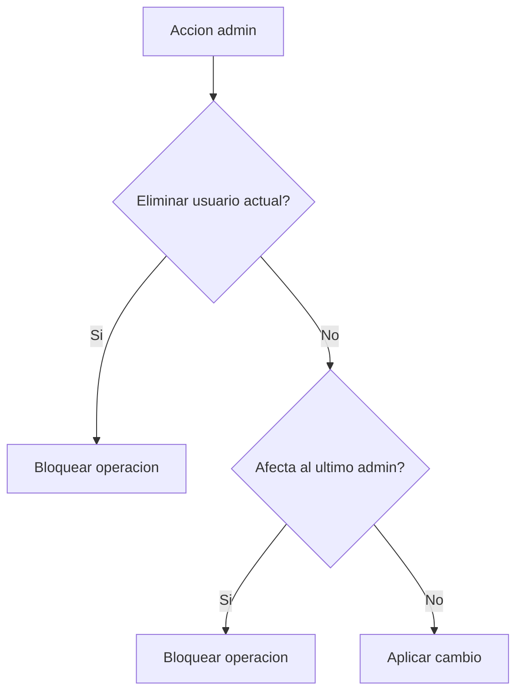

# Gestion de usuarios

## Proposito

La gestion de usuarios permite que un administrador controle el acceso al CMS sin modificar la base de datos manualmente. La funcionalidad vive en `/admin/users` y extiende el CMS existente de noticias.

## Acceso

La pagina esta protegida por los middleware `auth` y `admin`.

| Usuario | Resultado |
| --- | --- |
| No autenticado | Redireccion al login. |
| Autenticado sin `is_admin` | Respuesta `403`. |
| Autenticado con `is_admin` | Acceso a `/admin/users`. |

## Funciones

- Listar todos los usuarios registrados.
- Ver nombre, correo, rol, estado de verificacion y fecha de creacion.
- Otorgar rol administrador.
- Revocar rol administrador.
- Eliminar usuarios.

## Reglas de seguridad

Reglas implementadas:

- Un administrador no puede eliminar su propia cuenta.
- El ultimo administrador no puede ser eliminado.
- El ultimo administrador no puede perder el rol admin.
- Un administrador puede eliminar usuarios normales.
- Un administrador puede eliminar otro administrador si queda al menos un administrador activo.

## Rutas

| Metodo | Ruta | Proposito |
| --- | --- | --- |
| `GET` | `/admin/users` | Listar usuarios. |
| `POST` | `/admin/users/{user}/grant-admin` | Otorgar rol admin. |
| `POST` | `/admin/users/{user}/revoke-admin` | Revocar rol admin. |
| `DELETE` | `/admin/users/{user}` | Eliminar usuario. |

## Pruebas

La cobertura esta en `Tests\Feature\Admin\AdminUserManagementTest`.

Casos cubiertos:

- Usuario no admin no accede a la gestion.
- Admin lista usuarios registrados.
- Admin otorga rol administrador.
- Admin revoca rol administrador cuando queda otro admin.
- El ultimo admin no puede perder su rol.
- Admin no puede eliminarse a si mismo.
- Admin puede eliminar usuarios normales.
