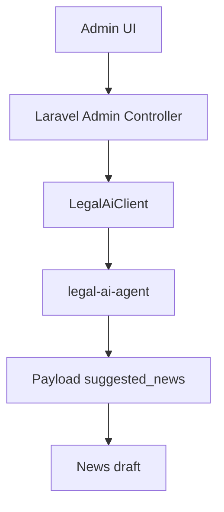

# Integracion AI

## Arquitectura

NewsHub integra el Admin CMS con `legal-ai-agent` mediante un cliente Laravel interno.



## Comunicacion Laravel a FastAPI

El cliente `App\Services\LegalAi\LegalAiClient` llama:

```text
POST /api/legal/process-url
```

URL interna:

```text
http://legal-ai-agent:8000
```

## Variables de entorno

```env
LEGAL_AI_AGENT_URL=http://legal-ai-agent:8000
LEGAL_AI_AGENT_TIMEOUT=120
LEGAL_AI_AGENT_SHARED_SECRET=
```

## Flujo admin

1. Admin entra a `/admin/ai-drafts`.
2. Pega una URL HTTP/HTTPS directa a PDF o una pagina que enlace un PDF.
3. Presiona `Procesar con IA`.
4. Revisa titulo, resumen, puntos clave y metadata legal.
5. Guarda como borrador.
6. Edita el borrador en el CMS de noticias.
7. Publica manualmente si corresponde.

## Seguridad

- Solo administradores pueden usar la funcionalidad.
- Las claves de Cerebras permanecen en `legal-ai-agent`.
- Laravel no envia claves IA al navegador.
- Todo resultado se guarda como `draft`.
- La revision humana es obligatoria.

## Manejo de errores

Errores del agente, timeouts o payloads invalidos se muestran como errores del formulario de URL.

## Resultados

```text
Backend tests: 56 passed (220 assertions)
Frontend build: tsc && vite build, built in 1.34s
Docusaurus build: Generated static files in "build".
```
