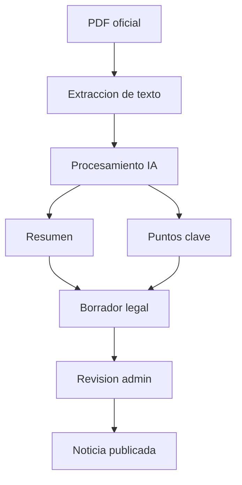

# Preparacion IA

## Alcance actual

No se implemento extraccion real de IA. Se preparo la base de datos, backend y CMS para recibir borradores legales generados por un modulo futuro.

## Campos preparados

| Campo | Uso futuro |
| --- | --- |
| `ai_generated` | Marca contenido generado por IA. |
| `ai_summary` | Resumen del documento legal. |
| `ai_key_points` | Puntos clave en estructura JSON. |
| `original_pdf_url` | Fuente PDF oficial. |
| `extracted_text` | Texto crudo extraido del PDF. |

## Flujo futuro esperado

## Regla de seguridad editorial

Las noticias con `ai_generated = true` se guardan inicialmente como `draft`. Esto evita publicar contenido generado automaticamente sin revision humana.

## Riesgos pendientes

- Seleccionar proveedor o modelo IA.
- Definir extraccion confiable de PDF.
- Registrar trazabilidad de prompts y versiones.
- Agregar auditoria de cambios editoriales.
- Validar exactitud legal antes de publicar.
