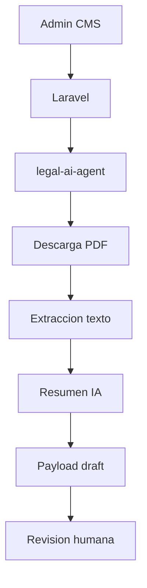

# Legal AI Agent

## Proposito

`legal-ai-agent` es un microservicio FastAPI para procesar publicaciones legales PDF desde URLs HTTP/HTTPS y generar borradores estructurados para el Admin CMS de NewsHub.

## Arquitectura

Usa Clean Architecture:

- `domain`: entidades, interfaces y errores.
- `application`: casos de uso y servicios.
- `infrastructure`: descarga PDF, extraccion de texto y cliente Cerebras.
- `presentation`: endpoints FastAPI.

## Endpoints

| Metodo | Ruta | Proposito |
| --- | --- | --- |
| `GET` | `/api/health` | Estado del servicio. |
| `POST` | `/api/legal/process-url` | Procesa una URL de Legal DCA. |
| `POST` | `/api/legal/process-pdf` | Procesa un PDF enviado. |
| `POST` | `/api/legal/summarize` | Resume texto legal. |
| `POST` | `/api/legal/create-draft` | Crea un draft sin escribir en Laravel. |

## Variables de entorno

| Variable | Proposito |
| --- | --- |
| `CEREBRAS_API_KEY` | API key, nunca versionada. |
| `CEREBRAS_BASE_URL` | Endpoint compatible OpenAI. |
| `CEREBRAS_MODEL` | Modelo de resumen. |
| `AI_REQUEST_TIMEOUT_SECONDS` | Timeout IA. |
| `AI_MAX_INPUT_CHARS` | Limite de texto enviado. |
| `NEWSHUB_API_URL` | URL futura de Laravel. |
| `NEWSHUB_AI_SHARED_SECRET` | Secreto futuro compartido. |

## Flujo



## Seguridad y revision

El servicio no auto-publica noticias. Todo resultado queda con `status = draft` y requiere revision humana antes de publicacion.

## Docker

```bash
cp legal-ai-agent/.env.example legal-ai-agent/.env
docker compose build legal-ai-agent
docker compose up -d legal-ai-agent
docker compose exec legal-ai-agent pytest
curl http://localhost:8000/api/health
```

URL interna desde Laravel:

```text
http://legal-ai-agent:8000/api/health
```

## Limitaciones

- La deteccion de PDFs en paginas HTML usa parsing simple.
- No se implemento Playwright.
- No se guarda directamente en MySQL.
- Sin credenciales IA, los endpoints de analisis devuelven error de configuracion.

## Resultados de validacion

```text
docker compose build legal-ai-agent: Built
docker compose up -d legal-ai-agent: healthy
GET http://localhost:8000/api/health: 200 OK
docker compose exec legal-ai-agent pytest: 10 passed in 0.71s
```
