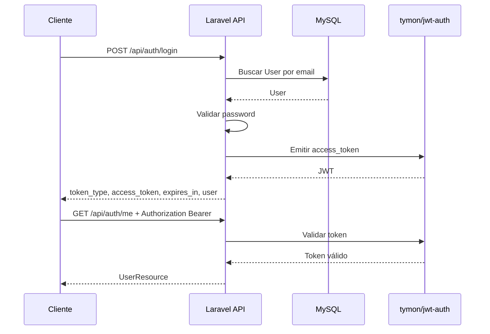

# Autenticación API

## Estrategia

La API usa `JWT` con `tymon/jwt-auth` como mecanismo principal de autenticación. Los endpoints protegidos usan `auth:api`.

El cliente debe enviar el token en cada solicitud protegida:

```text
Authorization: Bearer <token>
```

`Sanctum` no se usa como estrategia principal de autenticación API.

## Flujo de autenticación



## Endpoints

| Método | Ruta | Protección | Descripción |
| --- | --- | --- | --- |
| `POST` | `/api/auth/register` | Pública | Registra usuario y emite token |
| `POST` | `/api/auth/login` | Pública | Autentica usuario y emite token |
| `GET` | `/api/auth/me` | `auth:api` | Devuelve usuario autenticado |
| `POST` | `/api/auth/refresh` | `auth:api` | Renueva token |
| `POST` | `/api/auth/logout` | `auth:api` | Invalida token |

## Register

### Request

```http
POST /api/auth/register
Content-Type: application/json
```

```json
{
  "name": "Jane Doe",
  "email": "jane@example.com",
  "password": "password",
  "password_confirmation": "password"
}
```

### Response `201 Created`

```json
{
  "data": {
    "user": {
      "id": 1,
      "name": "Jane Doe",
      "email": "jane@example.com"
    },
    "token_type": "bearer",
    "access_token": "jwt-token",
    "expires_in": 3600
  }
}
```

## Login

### Request

```http
POST /api/auth/login
Content-Type: application/json
```

```json
{
  "email": "jane@example.com",
  "password": "password"
}
```

### Response `200 OK`

```json
{
  "data": {
    "user": {
      "id": 1,
      "name": "Jane Doe",
      "email": "jane@example.com"
    },
    "token_type": "bearer",
    "access_token": "jwt-token",
    "expires_in": 3600
  }
}
```

## Me

```http
GET /api/auth/me
Authorization: Bearer <token>
```

Response `200 OK`:

```json
{
  "data": {
    "id": 1,
    "name": "Jane Doe",
    "email": "jane@example.com"
  }
}
```

## Refresh

```http
POST /api/auth/refresh
Authorization: Bearer <token>
```

Response `200 OK`:

```json
{
  "data": {
    "user": null,
    "token_type": "bearer",
    "access_token": "new-jwt-token",
    "expires_in": 3600
  }
}
```

## Logout

```http
POST /api/auth/logout
Authorization: Bearer <token>
```

Response `204 No Content`.

