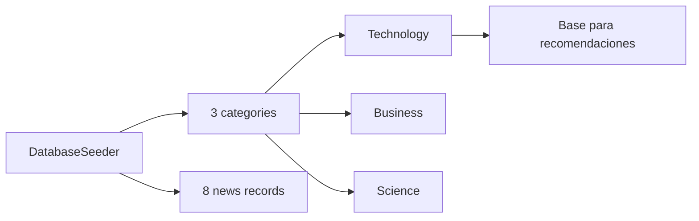

# API de categorías

Las categorías permiten clasificar noticias y consultar contenido por tema. Las categorías se resuelven por `slug` mediante route model binding.

## Entidad `categories`

| Campo | Tipo | Descripción |
| --- | --- | --- |
| `id` | integer | Identificador interno |
| `name` | string | Nombre visible |
| `slug` | string | Identificador público en URL |
| `description` | text | Descripción opcional |

## Listar categorías

```http
GET /api/categories
```

Response `200 OK`:

```json
{
  "data": [
    {
      "id": 1,
      "name": "Technology",
      "slug": "technology",
      "description": "Technology news and analysis."
    },
    {
      "id": 2,
      "name": "Business",
      "slug": "business",
      "description": "Business and markets coverage."
    },
    {
      "id": 3,
      "name": "Science",
      "slug": "science",
      "description": "Science and innovation updates."
    }
  ]
}
```

## Noticias por categoría

```http
GET /api/categories/{category}/news
```

`{category}` corresponde al `slug`.

Response `200 OK`:

```json
{
  "data": [
    {
      "id": 1,
      "title": "News title",
      "slug": "news-title",
      "summary": "Short summary",
      "image_url": "https://example.com/image.jpg",
      "source": "NewsHub",
      "published_at": "2026-06-11T10:00:00.000000Z",
      "category": {
        "id": 1,
        "name": "Technology",
        "slug": "technology",
        "description": "Technology news and analysis."
      }
    }
  ]
}
```

## Datos sembrados

El seeder principal crea 3 categorías:

- `Technology`
- `Business`
- `Science`

También crea 8 noticias distribuidas entre esas categorías. La categoría `Technology` recibe suficientes noticias para validar recomendaciones del mismo tema.



