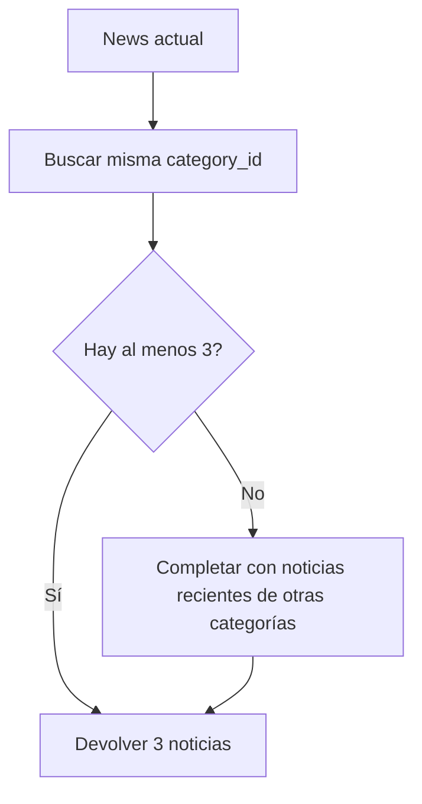

# API de noticias

La API de noticias expone listado, detalle y recomendaciones. Las noticias se resuelven por `slug` mediante route model binding.

## Entidad `news`

| Campo | Tipo | Descripción |
| --- | --- | --- |
| `id` | integer | Identificador interno |
| `category_id` | integer | Relación con `categories` |
| `title` | string | Título de la noticia |
| `slug` | string | Identificador público en URL |
| `summary` | text | Resumen |
| `content` | longtext | Contenido completo |
| `image_url` | string | Imagen opcional |
| `source` | string | Fuente |
| `published_at` | timestamp | Fecha de publicación |

## Listar noticias

```http
GET /api/news
```

Parámetros opcionales:

| Parámetro | Descripción |
| --- | --- |
| `page` | Página de resultados |
| `per_page` | Tamaño de página, máximo 20 |
| `category` | Filtra por `categories.slug` |
| `search` | Busca por `title` o `summary` |

Response `200 OK`:

```json
{
  "data": [
    {
      "id": 1,
      "title": "News title",
      "slug": "news-title",
      "summary": "Short summary",
      "image_url": "https://example.com/image.jpg",
      "source": "NewsHub",
      "published_at": "2026-06-11T10:00:00.000000Z",
      "category": {
        "id": 1,
        "name": "Technology",
        "slug": "technology",
        "description": "Technology news and analysis."
      }
    }
  ]
}
```

## Detalle de noticia

```http
GET /api/news/{news}
```

`{news}` corresponde al `slug`.

Response `200 OK`:

```json
{
  "data": {
    "id": 1,
    "title": "News title",
    "slug": "news-title",
    "summary": "Short summary",
    "content": "Full content",
    "image_url": "https://example.com/image.jpg",
    "source": "NewsHub",
    "published_at": "2026-06-11T10:00:00.000000Z",
    "category": {
      "id": 1,
      "name": "Technology",
      "slug": "technology",
      "description": "Technology news and analysis."
    }
  }
}
```

## Noticias recomendadas

```http
GET /api/news/{news}/recommended
```

Reglas:

- Excluye la noticia actual.
- Prioriza noticias de la misma categoría.
- Devuelve al menos 3 elementos cuando existen suficientes datos.
- Usa `NewsRecommendationService`.



Response `200 OK`:

```json
{
  "data": [
    {
      "id": 2,
      "title": "Related news",
      "slug": "related-news",
      "summary": "Related summary",
      "image_url": "https://example.com/image.jpg",
      "source": "NewsHub",
      "published_at": "2026-06-11T11:00:00.000000Z",
      "category": {
        "id": 1,
        "name": "Technology",
        "slug": "technology",
        "description": "Technology news and analysis."
      }
    }
  ]
}
```

