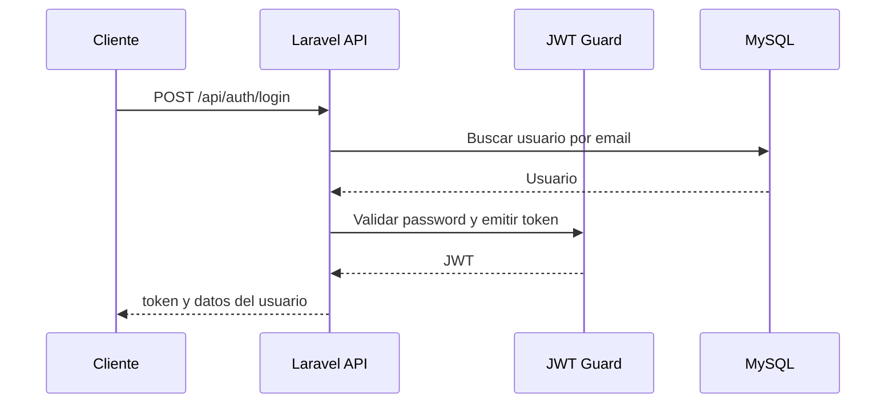

# Estrategia de autenticación

## Decisión

La autenticación de API se diseñará con `JWT`. La aplicación web puede usar sesión de Laravel para páginas Inertia si se requiere, pero los endpoints API protegidos deben exigir un token `JWT` válido.

## Endpoints sugeridos

| Método | Ruta | Protección | Descripción |
| --- | --- | --- | --- |
| `POST` | `/api/auth/register` | Pública | Registra un usuario |
| `POST` | `/api/auth/login` | Pública | Genera token `JWT` |
| `POST` | `/api/auth/logout` | `auth:api` | Invalida token |
| `GET` | `/api/auth/me` | `auth:api` | Devuelve usuario autenticado |

## Flujo de login

## Reglas

- Las credenciales deben validarse con Form Requests.
- El token debe enviarse con `Authorization: Bearer <token>`.
- Los tests deben cubrir login exitoso, login inválido y acceso no autorizado.

