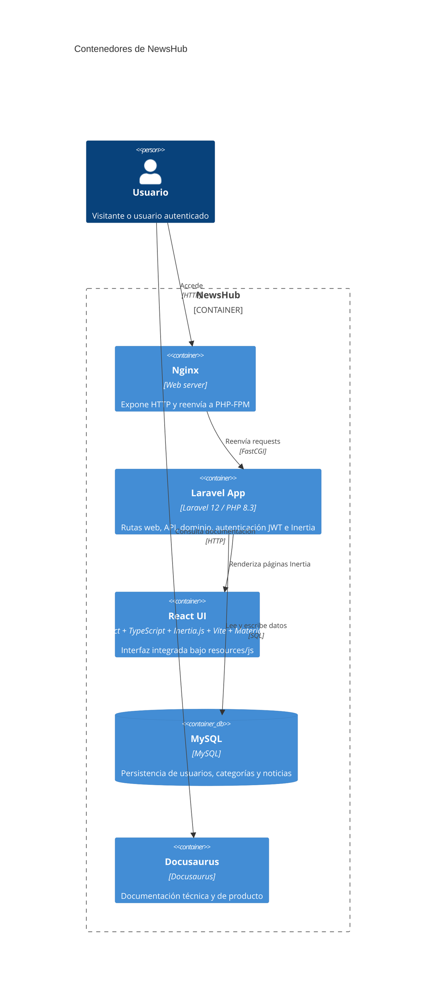

# Diagrama C4 - Contenedores

```mermaid
C4Container
    title Contenedores de NewsHub
    Person(user, "Usuario", "Visitante o usuario autenticado")
    Container_Boundary(system, "NewsHub") {
        Container(nginx, "Nginx", "Web server", "Expone HTTP y reenvía a PHP-FPM")
        Container(app, "Laravel App", "Laravel 12 / PHP 8.3", "Rutas web, API, dominio, autenticación JWT e Inertia")
        Container(frontend, "React UI", "React + TypeScript + Inertia.js + Vite + Material UI", "Interfaz integrada bajo resources/js")
        ContainerDb(mysql, "MySQL", "MySQL", "Persistencia de usuarios, categorías y noticias")
        Container(docs, "Docusaurus", "Docusaurus", "Documentación técnica y de producto")
    }
    Rel(user, nginx, "Accede", "HTTP")
    Rel(nginx, app, "Reenvía requests", "FastCGI")
    Rel(app, frontend, "Renderiza páginas Inertia")
    Rel(app, mysql, "Lee y escribe datos", "SQL")
    Rel(user, docs, "Consulta documentación", "HTTP")
```

La interfaz React forma parte del build de Laravel. Se representa por claridad arquitectónica porque tiene estructura, dependencias y pruebas propias.

