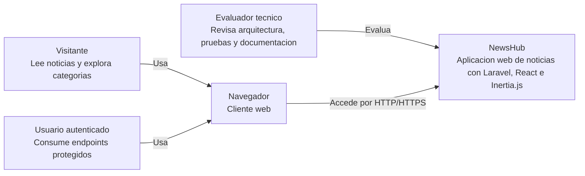

# Diagrama C4 - Contexto

```mermaid
flowchart LR
    visitor["Visitante<br/>Lee noticias y explora categorias"]
    user["Usuario autenticado<br/>Consume endpoints protegidos"]
    evaluator["Evaluador tecnico<br/>Revisa arquitectura, pruebas y documentacion"]
    browser["Navegador<br/>Cliente web"]
    newshub["NewsHub<br/>Aplicacion web de noticias con Laravel, React e Inertia.js"]

    visitor -->|Usa| browser
    user -->|Usa| browser
    evaluator -->|Evalua| newshub
    browser -->|Accede por HTTP/HTTPS| newshub
```

NewsHub concentra backend, frontend integrado y API en una sola aplicacion Laravel. Los endpoints privados requieren autenticacion con `JWT`.
