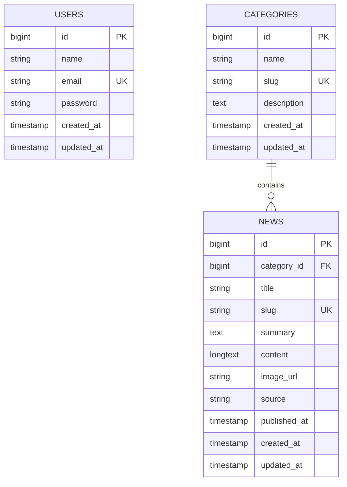

# Modelo de base de datos

## Entidades principales

### users

Campos sugeridos: `id`, `name`, `email`, `password`, `created_at`, `updated_at`.

### categories

Campos sugeridos: `id`, `name`, `slug`, `description`, `created_at`, `updated_at`.

### news

Campos sugeridos: `id`, `category_id`, `title`, `slug`, `summary`, `content`, `image_url`, `source`, `published_at`, `created_at`, `updated_at`.

## Relaciones

- `Category` tiene muchas `News`.
- `News` pertenece a `Category`.
- `User` se autentica en API mediante `JWT`; no se requiere relación directa con `News` para el alcance mínimo.

## Índices recomendados

- `users.email` único.
- `categories.slug` único.
- `news.slug` único.
- `news.category_id` indexado.
- `news.published_at` indexado.

## Diagrama entidad-relación

