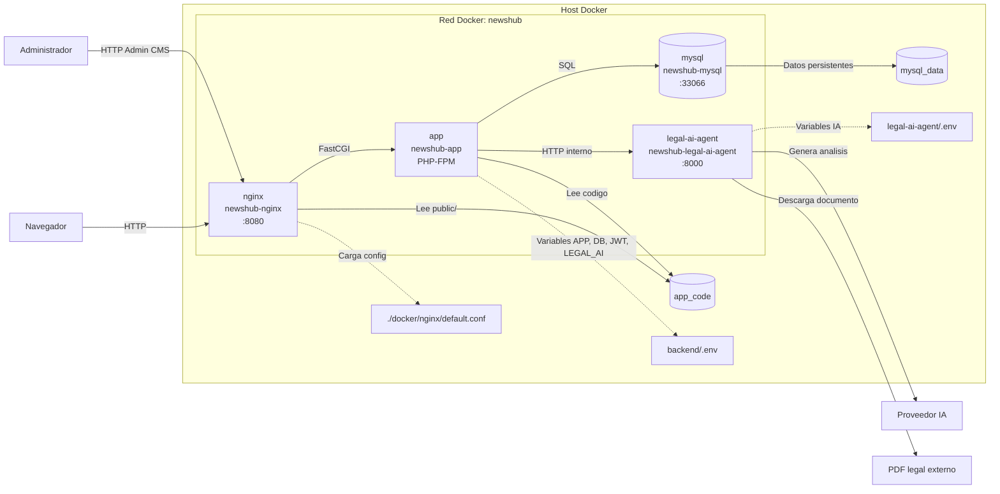

# Arquitectura Docker

## Servicios

La solucion se ejecuta con Docker Compose y separa responsabilidades minimas:

- `app`: contenedor PHP 8.4 con Laravel y PHP-FPM.
- `nginx`: servidor HTTP que expone la aplicacion.
- `mysql`: base de datos MySQL 8.4.
- `legal-ai-agent`: microservicio FastAPI para procesamiento de documentos legales con IA.
- `docs-site`: documentacion Docusaurus, ejecutada fuera del Compose principal o publicada como build estatico.

## Diagrama

## Flujo de ejecucion

1. El navegador entra por `newshub-nginx`.
2. Nginx sirve archivos publicos y delega solicitudes PHP a `newshub-app`.
3. Laravel atiende rutas web, endpoints API, autenticacion JWT y reglas editoriales.
4. Laravel consulta `newshub-mysql` para usuarios, categorias, noticias y tags.
5. Cuando un admin procesa una URL legal, Laravel llama a `newshub-legal-ai-agent`.
6. El agente descarga el documento, extrae texto, consulta el proveedor IA y devuelve un payload estructurado.

## Variables de entorno relevantes

- `APP_ENV`
- `APP_KEY`
- `APP_URL`
- `DB_CONNECTION`
- `DB_HOST`
- `DB_PORT`
- `DB_DATABASE`
- `DB_USERNAME`
- `DB_PASSWORD`
- `JWT_SECRET`
- `LEGAL_AI_AGENT_URL`
- `LEGAL_AI_AGENT_TIMEOUT`
- `LEGAL_AI_AGENT_SHARED_SECRET`

## Consideraciones

- MySQL debe persistir datos en el volumen `mysql_data`.
- Nginx debe apuntar al directorio publico de Laravel.
- El contenedor `app` debe ejecutar Composer y PHP-FPM.
- Los assets React se compilan con Vite dentro del proyecto Laravel, no en una aplicacion React separada.
- Las claves del proveedor IA pertenecen a `legal-ai-agent` y no deben exponerse al frontend.
