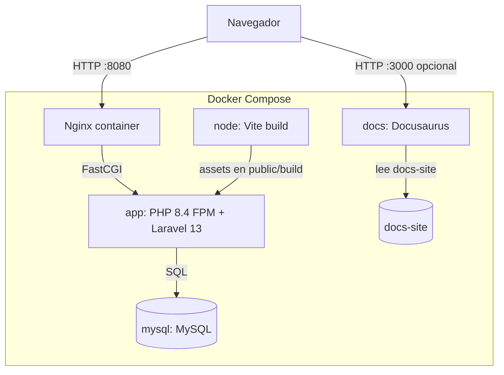

# Arquitectura Docker final

## Estado revisado

El repositorio aún no contiene `Dockerfile` ni `docker-compose.yml`. Esta arquitectura define el objetivo final requerido para que la solución pueda ejecutarse con Docker.

## Servicios finales

| Servicio | Responsabilidad | Puerto sugerido |
| --- | --- | --- |
| `nginx` | Servir HTTP y reenviar PHP a `app` | `8080:80` |
| `app` | Ejecutar Laravel con PHP-FPM 8.3 | Interno |
| `mysql` | Persistir datos de la aplicación | `3306:3306` opcional |
| `node` | Instalar dependencias y compilar assets con Vite | Uso temporal |
| `docs` | Ejecutar Docusaurus en desarrollo | `3000:3000` opcional |

## Diagrama final



## Variables mínimas

```text
APP_ENV=local
APP_URL=http://localhost:8080
DB_CONNECTION=mysql
DB_HOST=mysql
DB_PORT=3306
DB_DATABASE=newshub
DB_USERNAME=newshub
DB_PASSWORD=secret
SESSION_DRIVER=database
QUEUE_CONNECTION=database
JWT_SECRET=generated-jwt-secret
```

## Decisiones

- Nginx será el único punto de entrada HTTP para Laravel.
- MySQL será obligatorio para desarrollo y evaluación.
- Vite no se ejecutará como frontend standalone; solo compilará assets del proyecto Laravel.
- Docusaurus puede ejecutarse como servicio separado porque es documentación, no frontend de producto.
