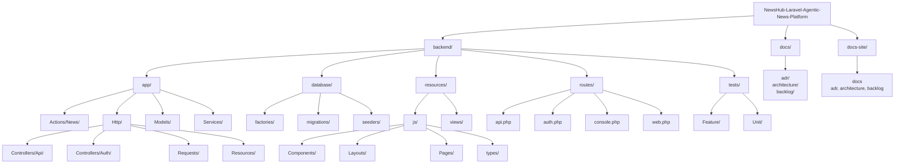

# Estructura final del proyecto

## Revisión aplicada

El proyecto ya contiene una aplicación Laravel inicializada en `backend/` con React, TypeScript, Inertia.js, Vite y Breeze. La estructura final respeta esa base y agrega únicamente carpetas previstas para el dominio de noticias, API Resources, Form Requests, services/actions y pruebas.

## Alineación de stack

El backend actual declara `laravel/framework` con versión `^13.8`, por lo que la documentación final queda alineada a Laravel 13 y PHP 8.4.

## Estructura final

## Reglas finales

- No crear una aplicación React standalone.
- Mantener todo el frontend de producto bajo `backend/resources/js`.
- Usar `resources/js/Pages` para páginas Inertia.
- Usar `resources/js/Components` para componentes compartidos.
- Usar `resources/js/types` para tipos TypeScript.
- Usar `routes/web.php` para páginas Inertia.
- Usar `routes/api.php` para endpoints JSON.
- Usar `auth:api` con `tymon/jwt-auth` en endpoints API protegidos.
- Usar Form Requests para validación.
- Usar API Resources para respuestas JSON.
- Mantener Docusaurus bajo `docs-site`.
