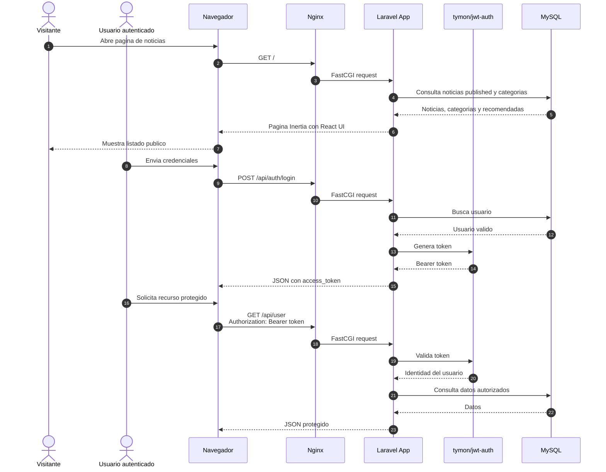

# Diagrama de secuencia

Este diagrama resume el flujo principal de lectura publica, autenticacion JWT y acceso a endpoints protegidos.

## Criterios representados

- El portal publico solo muestra noticias `published`.
- La API protegida requiere `Authorization: Bearer <token>`.
- JWT es el mecanismo principal de autenticacion API.
- Breeze/Inertia queda limitado a experiencia web y administracion.
