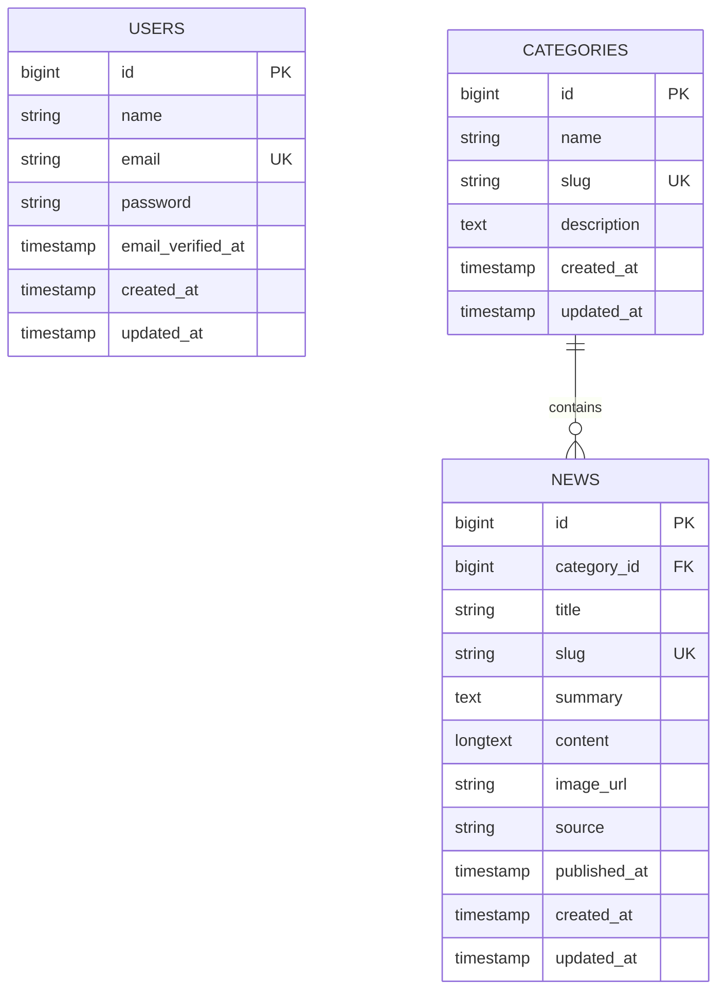

# Reporte de implementación backend

## Resumen

Se completó la implementación backend de NewsHub sobre Laravel 13 y PHP 8.4. El backend expone una API JSON para autenticación, noticias, categorías y recomendaciones.

La autenticación principal de API usa `JWT` con `tymon/jwt-auth`. Breeze/Inertia permanece como scaffolding web, pero no define la seguridad de la API.

## Archivos principales

### Configuración

- `backend/composer.json`
- `backend/composer.lock`
- `backend/bootstrap/app.php`
- `backend/config/auth.php`
- `backend/config/jwt.php`
- `backend/.env.example`
- `backend/phpunit.xml`

### Dominio

- `backend/app/Models/User.php`
- `backend/app/Models/Category.php`
- `backend/app/Models/News.php`
- `backend/database/migrations/2026_06_11_000001_create_categories_table.php`
- `backend/database/migrations/2026_06_11_000002_create_news_table.php`
- `backend/database/factories/CategoryFactory.php`
- `backend/database/factories/NewsFactory.php`
- `backend/database/seeders/DatabaseSeeder.php`

### API

- `backend/routes/api.php`
- `backend/app/Http/Controllers/Api/AuthController.php`
- `backend/app/Http/Controllers/Api/NewsController.php`
- `backend/app/Http/Controllers/Api/CategoryController.php`
- `backend/app/Http/Requests/Api/Auth/RegisterRequest.php`
- `backend/app/Http/Requests/Api/Auth/LoginRequest.php`
- `backend/app/Http/Resources/UserResource.php`
- `backend/app/Http/Resources/CategoryResource.php`
- `backend/app/Http/Resources/NewsResource.php`
- `backend/app/Services/NewsRecommendationService.php`

## Entidades de base de datos

| Entidad | Propósito |
| --- | --- |
| `users` | Usuarios autenticables mediante `JWT` |
| `categories` | Clasificación temática de noticias |
| `news` | Noticias publicadas y consultables por `slug` |



## Datos sembrados

El seeder principal crea:

- 1 usuario demo: `demo@newshub.test`.
- 3 categorías: `Technology`, `Business`, `Science`.
- 8 noticias distribuidas entre categorías.

## Endpoints implementados

| Método | Ruta | Protección | Descripción |
| --- | --- | --- | --- |
| `POST` | `/api/auth/register` | Pública | Registra usuario y devuelve token JWT |
| `POST` | `/api/auth/login` | Pública | Autentica usuario y devuelve token JWT |
| `GET` | `/api/auth/me` | `auth:api` | Devuelve usuario autenticado |
| `POST` | `/api/auth/refresh` | `auth:api` | Renueva token JWT |
| `POST` | `/api/auth/logout` | `auth:api` | Invalida token JWT |
| `GET` | `/api/news` | Pública | Lista noticias paginadas |
| `GET` | `/api/news/{news}` | Pública | Devuelve detalle por `slug` |
| `GET` | `/api/news/{news}/recommended` | Pública | Devuelve noticias recomendadas |
| `GET` | `/api/categories` | Pública | Lista categorías |
| `GET` | `/api/categories/{category}/news` | Pública | Lista noticias por categoría |

## Pruebas

Comando ejecutado:

```bash
docker run --rm -v "${PWD}:/app" -w /app composer:2 php artisan test
```

Resultado:

```text
Tests: 34 passed (140 assertions)
Duration: 22.86s
```

También se validó el registro de rutas API con:

```bash
docker run --rm -v "${PWD}:/app" -w /app composer:2 php artisan route:list --path=api
```

## Riesgos pendientes

- `JWT_SECRET` debe estar definido en `.env` para ejecución fuera de testing.
- La integración visual con React/Inertia queda para la fase frontend.
- El host local no tiene `php` ni `composer` en el `PATH`; la verificación se ejecutó mediante Docker.

