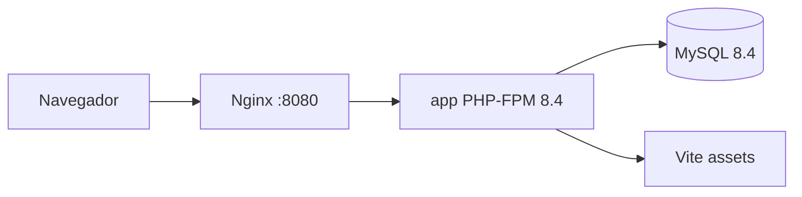

# Docker setup

NewsHub se ejecuta localmente con Docker Compose. La solución no requiere PHP, Composer ni MySQL instalados en el host.

## Servicios

| Servicio | Responsabilidad |
| --- | --- |
| `app` | Laravel 13 sobre PHP 8.4 FPM, Composer, Node y Vite. |
| `nginx` | Servidor HTTP que expone Laravel en `http://localhost:8080`. |
| `mysql` | Base de datos MySQL 8.4 con volumen persistente. |

El contenedor `app` incluye `pdo_mysql` para MySQL y `pdo_sqlite` para ejecutar la suite de pruebas con SQLite en memoria.

## Comandos

Construir y levantar:

```bash
docker compose up -d --build
```

Ver estado:

```bash
docker compose ps
```

Migrar y sembrar datos:

```bash
docker compose exec app php artisan migrate --seed
```

Ejecutar tests:

```bash
docker compose exec app php artisan test
```

Resultado validado:

```text
34 passed (140 assertions)
```

Compilar frontend:

```bash
docker compose exec app npm run build
```

## Diagrama



## Volúmenes

- `app_code`: comparte el código construido entre `app` y `nginx`.
- `mysql_data`: persiste datos de MySQL.

Si se reconstruye la imagen y se necesita refrescar completamente el código copiado en `app_code`, se puede eliminar el volumen con cuidado:

```bash
docker compose down -v
docker compose up -d --build
```
