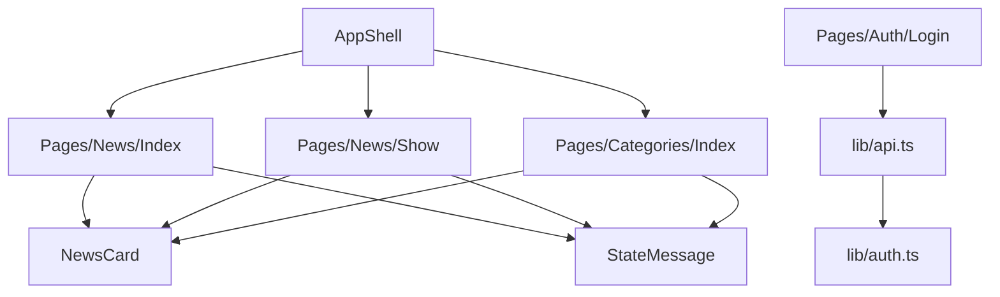

# Componentes frontend

Los componentes creados para la experiencia principal están bajo `backend/resources/js/Components`. Material UI se usa como base visual para mantener consistencia en layout, tarjetas, botones, tipografía y estados.

## Componentes principales

| Componente | Archivo | Responsabilidad |
| --- | --- | --- |
| `AppShell` | `Components/Layout/AppShell.tsx` | Define la estructura general, navegación superior y contenedor principal. |
| `NewsCard` | `Components/News/NewsCard.tsx` | Presenta una noticia en listados, categorías y recomendaciones. |
| `StateMessage` | `Components/News/StateMessage.tsx` | Centraliza mensajes de carga, error y contenido vacío. |

## Helpers relacionados

| Helper | Archivo | Responsabilidad |
| --- | --- | --- |
| `api.ts` | `lib/api.ts` | Cliente para llamadas a endpoints de autenticación, noticias y categorías. |
| `auth.ts` | `lib/auth.ts` | Persistencia y limpieza del token JWT y usuario en `localStorage`. |
| `news.ts` | `types/news.ts` | Tipos TypeScript compartidos para entidades y respuestas API. |

## Relación entre páginas y componentes

## Uso de Material UI

Material UI se utiliza para:

- Estructurar la navegación y los contenedores de página.
- Construir formularios, botones y estados visuales.
- Presentar noticias en tarjetas responsivas.
- Mantener una experiencia consistente entre páginas de listado, detalle, categorías y login.

## Componentes heredados

La base de Breeze/Inertia conserva componentes y páginas auxiliares de autenticación o perfil. Estos archivos pueden existir en el proyecto, pero el flujo API principal documentado para la prueba técnica usa JWT con `tymon/jwt-auth`, no Sanctum.
