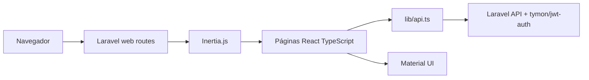

# Reporte de implementación frontend

## Resumen

El frontend de NewsHub fue implementado dentro de Laravel con React, TypeScript, Inertia.js, Vite y Material UI. La aplicación no tiene un frontend independiente: el código vive bajo `backend/resources/js` y se entrega desde Laravel.

La navegación usa Inertia.js y rutas web de Laravel. No se usa React Router.

La autenticación principal es JWT con `tymon/jwt-auth`; las solicitudes protegidas usan `Authorization: Bearer <token>`. Sanctum no se usa como estrategia principal de autenticación API.

## Stack frontend

- React + TypeScript para la interfaz.
- Inertia.js para renderizar páginas React desde Laravel.
- Vite para compilación y empaquetado.
- Material UI para componentes visuales y layout.
- `localStorage` para persistir el token JWT y datos mínimos del usuario.

## Resultado de build

Comando validado:

```bash
npm run build
```

Resultado:

```text
tsc && vite build
built
```

El build de Vite finalizó correctamente. Durante la validación local hubo un bloqueo inicial por permisos del directorio temporal usado por Tailwind/jiti en Windows; al reejecutar con permisos adecuados, la compilación terminó sin errores.

## Páginas implementadas

| Ruta web | Página Inertia | Propósito |
| --- | --- | --- |
| `/` | `backend/resources/js/Pages/News/Index.tsx` | Listado principal de noticias. |
| `/news/{news}` | `backend/resources/js/Pages/News/Show.tsx` | Detalle de noticia y recomendaciones. |
| `/categories` | `backend/resources/js/Pages/Categories/Index.tsx` | Categorías y noticias asociadas. |
| `/login` | `backend/resources/js/Pages/Auth/Login.tsx` | Inicio de sesión JWT. |

## Componentes principales

| Componente | Ubicación | Responsabilidad |
| --- | --- | --- |
| `AppShell` | `backend/resources/js/Components/Layout/AppShell.tsx` | Layout compartido y navegación. |
| `NewsCard` | `backend/resources/js/Components/News/NewsCard.tsx` | Tarjeta reutilizable para noticias. |
| `StateMessage` | `backend/resources/js/Components/News/StateMessage.tsx` | Estados de carga, error y vacío. |

## Endpoints API consumidos

| Método | Endpoint | Uso |
| --- | --- | --- |
| `POST` | `/api/auth/login` | Obtener token JWT. |
| `POST` | `/api/auth/logout` | Invalidar token JWT. |
| `GET` | `/api/news` | Listado de noticias. |
| `GET` | `/api/news/{news}` | Detalle de noticia. |
| `GET` | `/api/news/{news}/recommended` | Noticias recomendadas. |
| `GET` | `/api/categories` | Listado de categorías. |
| `GET` | `/api/categories/{category}/news` | Noticias por categoría. |

## Flujo general



## Riesgos pendientes

- El token JWT se almacena en `localStorage`, suficiente para la prueba técnica, pero requiere revisión de seguridad para producción.
- La expiración del token puede requerir manejo UX adicional.
- La interfaz depende de que `JWT_SECRET`, migraciones y seeders estén configurados correctamente.
- `npm audit` reportó vulnerabilidades críticas en dependencias existentes; no se corrigieron porque el alcance solicitado fue documental.

## Evidencia

- `npm run build`: aprobado.
- Pruebas backend previas: `34 passed (140 assertions)`.
