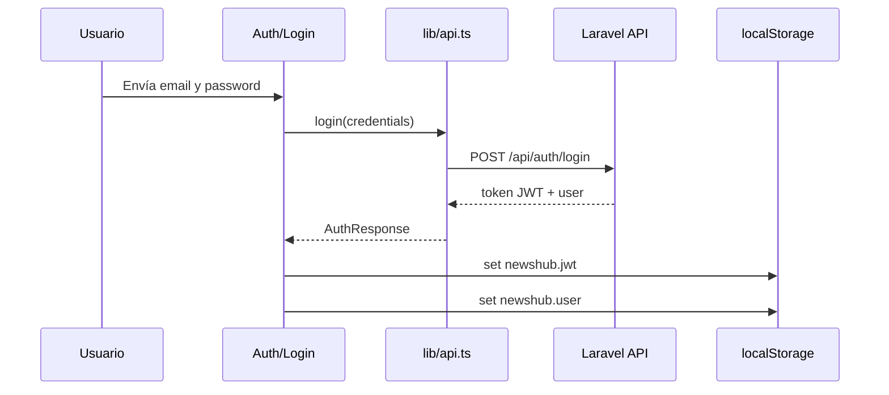
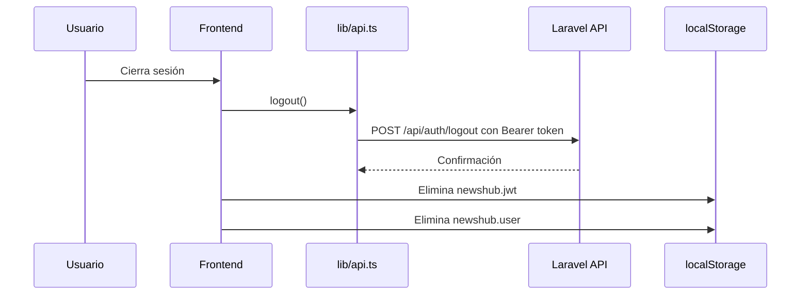

# Flujo JWT frontend

La autenticación del frontend usa JWT mediante `tymon/jwt-auth` en el backend. El token se envía en solicitudes protegidas con el encabezado `Authorization: Bearer <token>`.

Sanctum no se usa como estrategia principal de autenticación API.

## Login

1. El usuario ingresa credenciales en `Pages/Auth/Login.tsx`.
2. El frontend llama `POST /api/auth/login` desde `lib/api.ts`.
3. El backend valida credenciales y devuelve token JWT con datos del usuario.
4. `lib/auth.ts` guarda:
   - `newshub.jwt`: token JWT.
   - `newshub.user`: datos mínimos del usuario.
5. Las siguientes llamadas API pueden incluir `Authorization: Bearer <token>`.



## Uso del token

`lib/api.ts` centraliza el consumo de API. Cuando existe token, agrega:

```http
Authorization: Bearer <token>
```

Este patrón aplica para endpoints protegidos y para cualquier operación que requiera identidad autenticada.

## Logout

1. El usuario ejecuta cierre de sesión desde la interfaz.
2. Si existe token, el frontend llama `POST /api/auth/logout`.
3. El backend invalida el token activo.
4. El frontend elimina `newshub.jwt` y `newshub.user` de `localStorage`.



## Endpoints relacionados

| Método | Endpoint | Descripción |
| --- | --- | --- |
| `POST` | `/api/auth/login` | Autentica al usuario y emite JWT. |
| `POST` | `/api/auth/logout` | Invalida el JWT actual. |
| `GET` | `/api/news` | Obtiene noticias para la página principal. |
| `GET` | `/api/news/{news}` | Obtiene detalle de noticia. |
| `GET` | `/api/news/{news}/recommended` | Obtiene recomendaciones. |
| `GET` | `/api/categories` | Obtiene categorías. |
| `GET` | `/api/categories/{category}/news` | Obtiene noticias por categoría. |

## Riesgos y mejoras futuras

- `localStorage` es simple y suficiente para la prueba técnica, pero expone el token ante XSS si la aplicación tuviera una vulnerabilidad de scripting.
- Puede agregarse manejo explícito de expiración de token para redirigir a `/login`.
- Puede agregarse renovación de token si el backend expone un endpoint de refresh.
