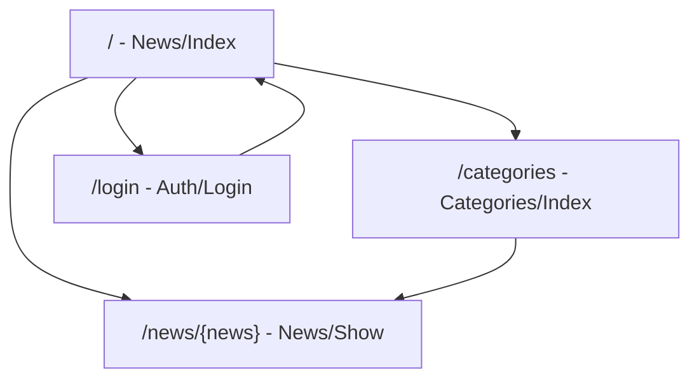

# Páginas frontend

El frontend está integrado en Laravel mediante Inertia.js. Las rutas web de Laravel renderizan páginas React ubicadas en `backend/resources/js/Pages`.

No se usa React Router; la navegación se realiza con Inertia.js y componentes como `Link` de `@inertiajs/react`.

## Mapa de páginas

| Ruta web | Página | Descripción |
| --- | --- | --- |
| `/` | `News/Index` | Página principal con listado de noticias, categorías disponibles y estados de carga o error. |
| `/news/{news}` | `News/Show` | Página de detalle de una noticia con contenido completo y noticias recomendadas. |
| `/categories` | `Categories/Index` | Página para consultar categorías y acceder a noticias asociadas. |
| `/login` | `Auth/Login` | Página de autenticación que consume `POST /api/auth/login` para obtener JWT. |

## Flujo de navegación

## Consumo de datos por página

| Página | Endpoints consumidos |
| --- | --- |
| `News/Index` | `GET /api/news`, `GET /api/categories` |
| `News/Show` | `GET /api/news/{news}`, `GET /api/news/{news}/recommended` |
| `Categories/Index` | `GET /api/categories`, `GET /api/categories/{category}/news` |
| `Auth/Login` | `POST /api/auth/login` |

## Consideraciones

- Las páginas React se resuelven desde Laravel, por lo que el frontend permanece dentro del monolito Laravel.
- La navegación conserva el modelo Inertia y evita duplicar un router cliente.
- Las rutas API mantienen nombres e identificadores en inglés.
