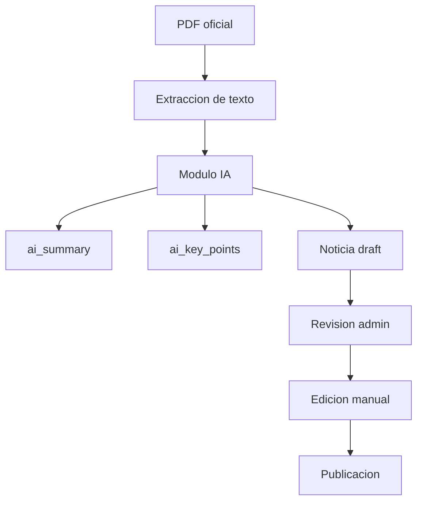

# Reporte Admin CMS

## 1. Proposito del Admin CMS

El Admin CMS permite que usuarios administradores gestionen noticias legales dentro de NewsHub. El portal publico sigue enfocado en lectura de noticias, mientras que el area `/admin` concentra el mantenimiento editorial.

El alcance implementado cubre:

- Listado interno de noticias.
- Creacion de noticias legales.
- Edicion de campos legales.
- Eliminacion de noticias.
- Publicacion y despublicacion.
- Asignacion de categoria.
- Asignacion de tags.
- Preparacion de borradores generados por IA.
- Listado de usuarios registrados.
- Asignacion y revocacion de rol administrador.
- Eliminacion controlada de usuarios.
- Proteccion contra perdida accidental del ultimo administrador.

JWT con `tymon/jwt-auth` sigue siendo el mecanismo principal para la API. Breeze/Inertia se usa solo como scaffolding web para paginas de usuario y administracion.

## 2. Roles y acceso admin

Se agrego `is_admin` a `users`.

- `is_admin = false`: usuario normal, puede navegar el portal publico.
- `is_admin = true`: usuario administrador, puede acceder a `/admin`.

La proteccion se implemento con `EnsureUserIsAdmin` y el alias de middleware `admin`. Las rutas admin usan `auth` y `admin`.

El seeder crea un usuario administrador:

```text
admin@newshub.test
```

## 3. Gestion de usuarios admin

Se agrego la seccion `/admin/users` para que un administrador pueda revisar todos los usuarios registrados y administrar el acceso al CMS.

Capacidades implementadas:

- Listar usuarios con nombre, correo, rol, verificacion de email y fecha de creacion.
- Otorgar rol administrador a usuarios normales.
- Revocar rol administrador cuando existe al menos otro administrador.
- Eliminar usuarios normales u otros administradores cuando la operacion no deja al sistema sin administradores.
- Bloquear la eliminacion del usuario autenticado.

Reglas de seguridad:

| Regla | Resultado |
| --- | --- |
| Usuario no admin intenta acceder a `/admin/users` | Respuesta `403`. |
| Admin intenta revocar el ultimo admin | Operacion rechazada con error de sesion. |
| Admin intenta eliminarse a si mismo | Operacion rechazada con error de sesion. |
| Admin elimina otro admin mientras queda al menos un admin activo | Operacion permitida. |
| Admin elimina usuario normal | Operacion permitida. |

Las acciones se implementaron en `App\Http\Controllers\Admin\UserController` y permanecen bajo los middleware `auth` y `admin`.

## 4. Campos de noticias legales

La entidad `news` fue extendida para soportar contenido legal:

| Campo | Proposito |
| --- | --- |
| `title` | Titulo editorial. |
| `slug` | Identificador URL. |
| `summary` | Resumen corto. |
| `body` | Cuerpo principal de la noticia. |
| `image_url` | Imagen asociada. |
| `category_id` | Categoria editorial. |
| `source_url` | Fuente oficial o referencia. |
| `publication_date` | Fecha de publicacion legal/editorial. |
| `status` | Estado editorial. |
| `legal_document_type` | Tipo de documento: ley, decreto, reforma, acuerdo o reglamento. |
| `decree_number` | Numero de decreto o referencia. |
| `institution` | Institucion emisora. |
| `affected_law` | Ley afectada. |
| `effective_date` | Fecha de vigencia. |
| `ai_generated` | Indica si el borrador vino de IA. |
| `ai_summary` | Resumen generado por IA. |
| `ai_key_points` | Puntos clave estructurados en JSON. |
| `original_pdf_url` | URL del PDF oficial. |
| `extracted_text` | Texto crudo extraido. |

Se mantiene `content` para compatibilidad con implementaciones previas, pero el flujo nuevo usa `body`.

## 5. Estados de noticias

NewsHub soporta:

- `draft`: borrador no visible publicamente.
- `published`: noticia visible en API y portal publico.
- `archived`: contenido retirado de la experiencia publica.

Los endpoints publicos filtran por `published`. Las paginas admin pueden consultar todos los estados.

## 6. Sistema de tags

Se agregaron:

- `tags`
- `news_tag`

Una noticia puede tener muchos tags y un tag puede pertenecer a muchas noticias.

Tags legales sembrados:

- `ley`
- `reforma`
- `decreto`
- `acuerdo`
- `reglamento`
- `congreso`
- `municipalidad`
- `tribunal`
- `ministerio`

## 7. Campos listos para IA

No se implemento extraccion real con IA. Se preparo el modelo y la UI para recibir borradores generados por un modulo futuro:

- `ai_generated`
- `ai_summary`
- `ai_key_points`
- `original_pdf_url`
- `extracted_text`

Cuando una noticia se crea con `ai_generated = true`, se guarda como `draft` aunque el payload solicite `published`. Esto obliga a revision humana antes de publicar.

## 8. Flujo futuro de IA



Pasos esperados:

1. El administrador registra o carga una fuente oficial PDF.
2. El modulo futuro extrae texto.
3. IA genera resumen y puntos clave.
4. El sistema crea una noticia `draft`.
5. El administrador revisa, corrige y asigna categoria/tags.
6. El administrador publica la noticia.

## 9. Tests agregados o actualizados

Se agregaron o actualizaron `Tests\Feature\Admin\AdminNewsCmsTest` y `Tests\Feature\Admin\AdminUserManagementTest`.

Cobertura:

- Usuario no admin no accede a rutas admin.
- Admin accede al listado de noticias.
- Admin crea noticia draft.
- Admin publica noticia.
- API publica solo devuelve noticias `published`.
- Draft queda oculto del detalle publico.
- Noticias pueden asignarse a tags.
- Noticias generadas por IA quedan como `draft` por defecto.
- Admin accede al listado de usuarios registrados.
- Admin otorga rol administrador.
- Admin revoca rol administrador cuando queda otro admin.
- El ultimo administrador no puede perder su rol.
- Un administrador no puede eliminarse a si mismo.
- Un administrador puede eliminar usuarios normales.

## 10. Resultados de build y tests

Backend:

```bash
docker run --rm -v "${PWD}:/app" -w /app composer:2 php artisan test
```

Resultado:

```text
Tests: 49 passed (191 assertions)
Duration: 26.33s
```

Frontend:

```bash
npm run build
```

Resultado:

```text
tsc && vite build
built in 8.54s
```

## 11. Riesgos pendientes

- El modulo real de IA no esta implementado.
- No existe carga de archivos PDF; por ahora se almacena `original_pdf_url`.
- No hay versionado editorial ni auditoria de cambios.
- La eliminacion de noticias es directa; en produccion podria requerirse soft delete.
- La eliminacion de usuarios es directa; en produccion podria requerirse soft delete y auditoria.
- La autenticacion web admin usa sesion Breeze/Inertia, mientras la API mantiene JWT como mecanismo principal.
