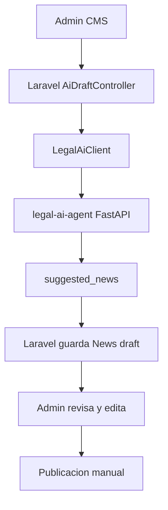

# Reporte de integracion AI

## 1. Proposito

Se conecto el Admin CMS de NewsHub con el microservicio `legal-ai-agent` para que un administrador pueda enviar una URL de PDF legal, recibir una propuesta generada por IA y guardarla como noticia `draft` para revision editorial.

## 2. Arquitectura de integracion



## 3. Comunicacion Laravel a FastAPI

Laravel usa `App\Services\LegalAi\LegalAiClient` para llamar:

```text
POST http://legal-ai-agent:8000/api/legal/process-url
```

El cliente:

- Usa `LEGAL_AI_AGENT_URL`.
- Aplica timeout con `LEGAL_AI_AGENT_TIMEOUT`.
- Puede enviar `X-NewsHub-AI-Secret` si se configura `LEGAL_AI_AGENT_SHARED_SECRET`.
- Maneja timeouts, errores HTTP y payloads invalidos.
- No expone claves de Cerebras al frontend.

## 4. Variables de entorno

Se agregaron a `backend/.env.example`:

```env
LEGAL_AI_AGENT_URL=http://legal-ai-agent:8000
LEGAL_AI_AGENT_TIMEOUT=120
LEGAL_AI_AGENT_SHARED_SECRET=
```

La configuracion vive en `backend/config/legal_ai.php`.

## 5. Flujo admin

1. El administrador entra a `/admin/ai-drafts`.
2. Pega una URL HTTP/HTTPS directa a PDF o una pagina que enlace un PDF.
3. Laravel llama a `legal-ai-agent`.
4. La pagina muestra previsualizacion del borrador.
5. El administrador guarda el resultado como `draft`.
6. El borrador aparece en el CMS de noticias.
7. El administrador edita y publica manualmente.

## 6. Creacion de borradores

Al guardar, Laravel persiste:

- `status = draft`
- `ai_generated = true`
- `ai_summary`
- `ai_key_points`
- `original_pdf_url`
- `extracted_text`
- campos legales disponibles
- tags sugeridos, creados si no existen

No se publica automaticamente.

## 7. Seguridad

- Las rutas usan `auth` y `admin`.
- Usuarios normales reciben `403`.
- El frontend nunca recibe claves de IA.
- El servicio Laravel solo consume el payload estructurado del agente.
- La revision humana sigue siendo obligatoria.

## 8. Manejo de errores

Errores del microservicio se devuelven como errores de formulario en `pdf_url`. Si el servicio no responde o devuelve un payload invalido, el administrador ve un mensaje controlado.

## 9. Pruebas

Se agrego `Tests\Feature\Admin\AdminAiDraftIntegrationTest`.

Cobertura:

- Usuario no admin no accede a `/admin/ai-drafts`.
- Admin accede a la pagina.
- `LegalAiClient` maneja respuesta exitosa.
- `LegalAiClient` maneja servicio no disponible.
- Admin procesa URL y recibe previsualizacion.
- Admin guarda borrador IA como noticia `draft`.
- Borrador IA no aparece en API publica hasta publicacion.

## 10. Riesgos pendientes

- Falta agregar un historial de auditoria para acciones de IA.
- La previsualizacion se transporta por sesion; para payloads enormes podria requerirse almacenamiento temporal.
- El secreto compartido esta preparado en Laravel, pero el agente todavia no lo valida.
- No se implemento carga directa de PDF desde Laravel.

## 11. Resultados

Backend:

```bash
docker run --rm -v "${PWD}:/app" -w /app composer:2 php artisan test
```

Resultado:

```text
Tests: 56 passed (220 assertions)
Duration: 27.07s
```

Frontend:

```bash
npm run build
```

Resultado:

```text
tsc && vite build
built in 1.34s
```

Docusaurus:

```bash
npm run build
```

Resultado:

```text
Generated static files in "build".
```
