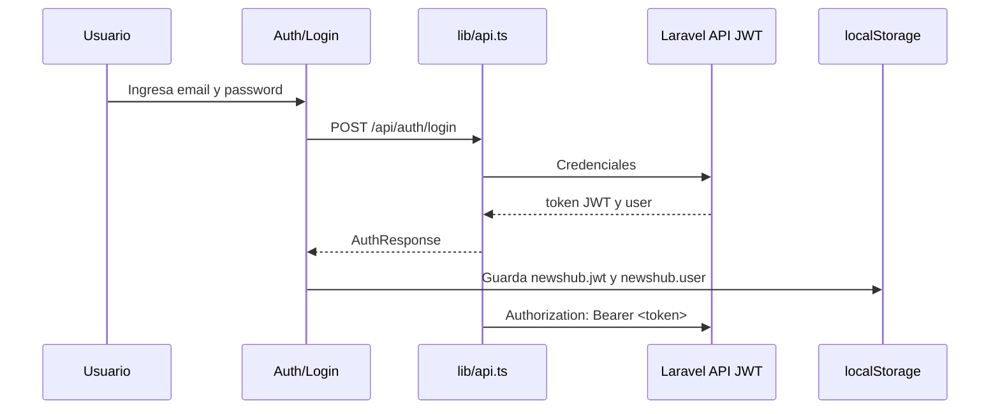

# Reporte de implementación frontend

## Resumen

El frontend de NewsHub fue implementado dentro de la aplicación Laravel, usando React, TypeScript, Inertia.js, Vite y Material UI. La solución no crea una aplicación frontend independiente y todo el código de interfaz vive bajo `backend/resources/js`.

La navegación de páginas usa Inertia.js y rutas web de Laravel. No se usa React Router.

La autenticación principal es JWT con `tymon/jwt-auth`; el frontend envía el token con `Authorization: Bearer <token>`. Sanctum no forma parte de la estrategia principal de autenticación API.

## Tecnologías usadas

- React + TypeScript como capa de interfaz.
- Inertia.js para integrar páginas React dentro de Laravel.
- Vite como empaquetador de frontend.
- Material UI para layout, componentes visuales, navegación, tarjetas, formularios, estados y botones.
- `localStorage` para persistencia local del token JWT y datos mínimos del usuario autenticado.

## Resultado de build

Comando validado:

```bash
npm run build
```

Resultado:

```text
tsc && vite build
built
```

El build de Vite finalizó correctamente. Durante la validación local existió un bloqueo inicial por permisos del directorio temporal usado por Tailwind/jiti en Windows; al reejecutar el comando con permisos adecuados, la compilación terminó sin errores.

## Páginas creadas o actualizadas

| Ruta web | Página Inertia | Propósito |
| --- | --- | --- |
| `/` | `backend/resources/js/Pages/News/Index.tsx` | Lista principal de noticias, categorías y estados de carga/error. |
| `/news/{news}` | `backend/resources/js/Pages/News/Show.tsx` | Detalle de una noticia y sección de noticias recomendadas. |
| `/categories` | `backend/resources/js/Pages/Categories/Index.tsx` | Exploración de categorías y noticias asociadas. |
| `/login` | `backend/resources/js/Pages/Auth/Login.tsx` | Inicio de sesión contra el endpoint JWT de la API. |

Las páginas se resuelven desde Laravel mediante Inertia.js. La navegación interna se realiza con `Link` de `@inertiajs/react`, no con React Router.

## Componentes creados

| Componente | Ubicación | Responsabilidad |
| --- | --- | --- |
| `AppShell` | `backend/resources/js/Components/Layout/AppShell.tsx` | Estructura visual compartida, barra de navegación y contenedor de página. |
| `NewsCard` | `backend/resources/js/Components/News/NewsCard.tsx` | Presentación reutilizable de noticias en listados y recomendaciones. |
| `StateMessage` | `backend/resources/js/Components/News/StateMessage.tsx` | Estados de carga, error y contenido vacío. |

También se mantiene la estructura base generada por Breeze/Inertia para páginas y componentes de autenticación o perfil, pero el flujo API principal documentado usa JWT.

## Helpers y tipos frontend

| Archivo | Propósito |
| --- | --- |
| `backend/resources/js/lib/api.ts` | Cliente API para autenticación, noticias, recomendaciones y categorías. |
| `backend/resources/js/lib/auth.ts` | Lectura, escritura y limpieza del token JWT y datos de usuario en `localStorage`. |
| `backend/resources/js/types/news.ts` | Tipos TypeScript para `User`, `Category`, `News`, respuestas paginadas y respuestas de autenticación. |

## Endpoints API consumidos

| Método | Endpoint | Uso frontend |
| --- | --- | --- |
| `POST` | `/api/auth/login` | Autenticar usuario y obtener token JWT. |
| `POST` | `/api/auth/logout` | Invalidar token JWT activo. |
| `GET` | `/api/news` | Cargar listado paginado de noticias. |
| `GET` | `/api/news/{news}` | Cargar detalle de noticia. |
| `GET` | `/api/news/{news}/recommended` | Cargar noticias recomendadas relacionadas. |
| `GET` | `/api/categories` | Cargar listado de categorías. |
| `GET` | `/api/categories/{category}/news` | Cargar noticias filtradas por categoría. |

## Flujo de autenticación JWT

1. El usuario envía credenciales desde `Auth/Login`.
2. La página llama `POST /api/auth/login`.
3. La API responde con un token JWT y datos del usuario.
4. `lib/auth.ts` guarda el token como `newshub.jwt` y el usuario como `newshub.user`.
5. `lib/api.ts` añade `Authorization: Bearer <token>` a las solicitudes que requieren autenticación.
6. Al cerrar sesión, el frontend llama `POST /api/auth/logout` si existe token y luego limpia el estado local.



## Manejo del token JWT

- El token se almacena localmente bajo la clave `newshub.jwt`.
- Los datos mínimos del usuario se almacenan bajo `newshub.user`.
- El cliente API agrega el encabezado `Authorization: Bearer <token>` cuando corresponde.
- El logout limpia el token y el usuario del navegador después de intentar invalidar la sesión en la API.
- No se usa Sanctum como mecanismo principal de autenticación.

## Uso de Material UI

Material UI se usa para construir una interfaz consistente sin crear un sistema visual propio desde cero. Los componentes MUI cubren:

- Estructura de página y navegación.
- Formularios de login.
- Tarjetas de noticias.
- Listados y grillas responsivas.
- Estados de carga, error y vacío.
- Botones, chips, tipografía y contenedores.

## Riesgos pendientes

- El almacenamiento de JWT en `localStorage` es suficiente para la prueba técnica, pero en producción requiere revisión de exposición ante XSS y políticas de expiración/renovación.
- La UI depende de que `JWT_SECRET`, migraciones y seeders estén configurados correctamente en el entorno Laravel.
- La experiencia de usuario ante expiración de token puede requerir mejoras, como redirección automática a login o mensajes más específicos.
- `npm audit` reportó vulnerabilidades críticas en dependencias existentes; no se ejecutó `npm audit fix` para evitar cambios fuera del alcance documental.

## Evidencia complementaria

- Frontend build: `npm run build` aprobado.
- Pruebas backend previas: `34 passed (140 assertions)`.
