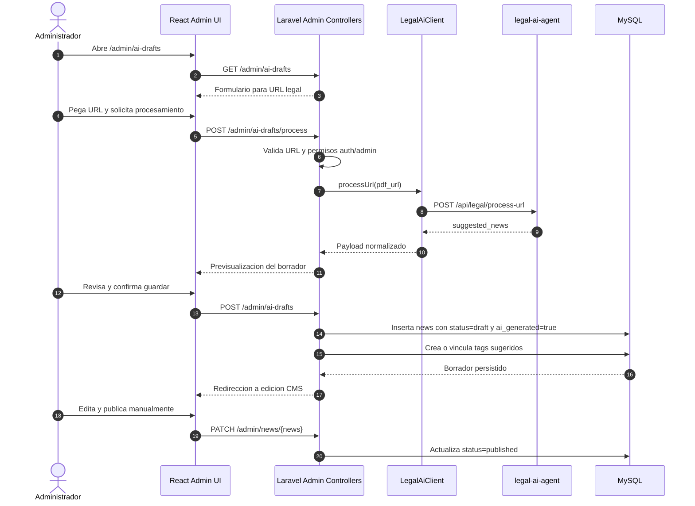

# Flujo de borradores Admin IA

## Reglas editoriales

- Solo usuarios con middleware `auth` y `admin` pueden usar el flujo.
- El resultado de IA nunca se publica automaticamente.
- Todo contenido generado por IA se guarda con `status = draft` y `ai_generated = true`.
- El administrador mantiene la responsabilidad de revisar, corregir y publicar.
