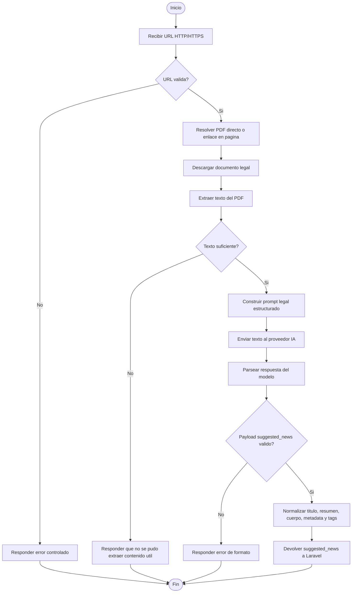

# Flujo de procesamiento IA

## Salida esperada

El agente debe devolver un payload estructurado con `suggested_news`, incluyendo titulo, resumen, cuerpo, metadata legal, puntos clave, texto extraido y tags sugeridos. Laravel decide si guarda el resultado y siempre lo conserva como borrador editorial.
