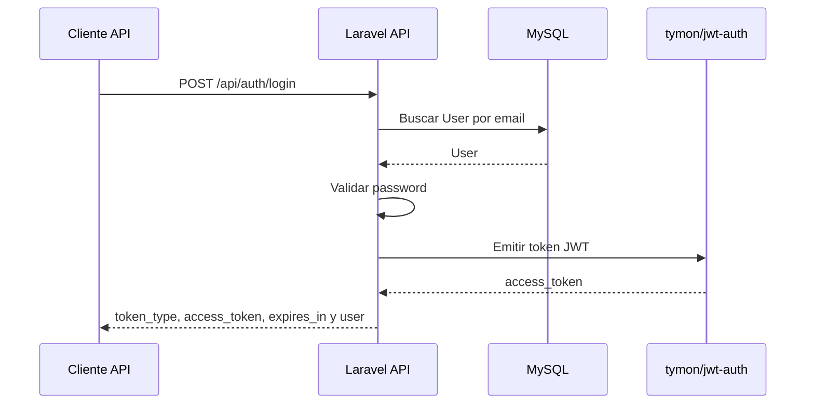

# Estrategia de autenticación final

## Revisión de la base inicializada

El proyecto Laravel dentro de `backend/` ya incluye scaffolding web con Breeze, Inertia.js, React y TypeScript. Ese scaffolding puede seguir existiendo para páginas web, pero no define la autenticación principal de la API.

La prueba técnica requiere explícitamente autenticación `JWT`. Por lo tanto, la arquitectura final usará:

- Sesión web de Laravel solo para páginas Inertia generadas por Breeze, cuando aplique.
- `JWT` con `tymon/jwt-auth` para endpoints API protegidos.
- Header `Authorization: Bearer <token>` para solicitudes autenticadas.

`Sanctum` no debe usarse como mecanismo principal de autenticación API.

## Objetivos

- Cumplir el requisito explícito de autenticación `JWT`.
- Mantener la API desacoplada de la sesión web.
- Proteger endpoints privados con un token bearer.
- Evitar mezclar `Sanctum` y `JWT` como estrategias simultáneas.

## Autenticación web

Las rutas web existentes de Breeze pueden usar middleware `auth` y `verified` para páginas como `/dashboard` y `/profile`. Este flujo es válido para la experiencia web Inertia, pero no reemplaza la autenticación API.

## Autenticación API

Los endpoints API protegidos deben usar el guard configurado para `tymon/jwt-auth`, por ejemplo `auth:api`.

El token debe enviarse con:

```text
Authorization: Bearer <token>
```

Endpoints API de autenticación propuestos:

| Método | Ruta | Protección | Descripción |
| --- | --- | --- | --- |
| `POST` | `/api/auth/register` | Pública | Registra un usuario para uso API |
| `POST` | `/api/auth/login` | Pública | Devuelve token `JWT` |
| `GET` | `/api/auth/me` | `auth:api` | Devuelve usuario autenticado |
| `POST` | `/api/auth/refresh` | `auth:api` | Renueva el token |
| `POST` | `/api/auth/logout` | `auth:api` | Invalida el token actual |

## Flujo de login API



## Reglas

- Las credenciales deben validarse con Form Requests.
- Las respuestas JSON deben usar API Resources cuando devuelvan entidades.
- Los endpoints protegidos deben rechazar solicitudes sin token válido con `401 Unauthorized`.
- El logout API debe invalidar el token actual.
- El refresh debe renovar el token según la configuración de `tymon/jwt-auth`.
- Las pruebas deben cubrir login exitoso, login inválido, acceso sin token, acceso con token, refresh y logout.
