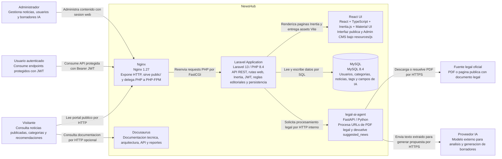

# Diagrama C4 - Contenedores

## Descripcion

La interfaz React no es una aplicacion desplegable independiente: vive dentro del proyecto Laravel en `resources/js` y se publica como assets de Vite. Se muestra como contenedor logico porque tiene componentes, pruebas y responsabilidades propias dentro de la experiencia web.
