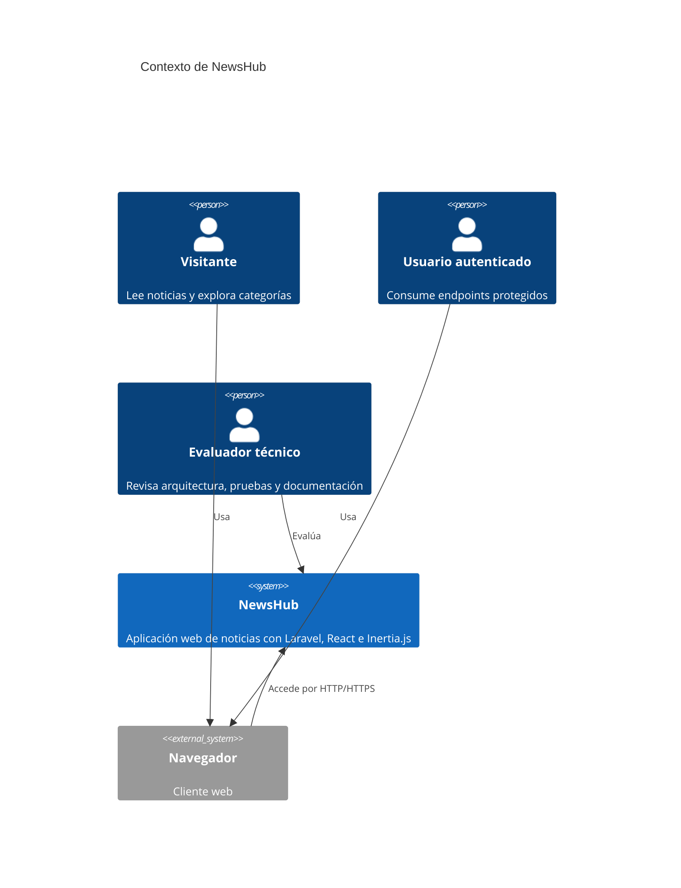

# Diagrama C4 - Contexto

## Descripción

NewsHub concentra backend, frontend integrado y API en una sola aplicación Laravel. Los usuarios interactúan mediante navegador y los endpoints privados requieren autenticación `JWT`.

