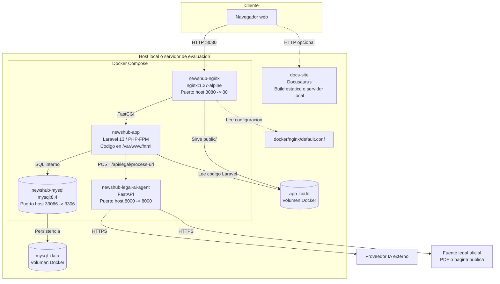

# Diagrama de despliegue

## Notas

- `docker-compose.yml` orquesta `app`, `nginx`, `mysql` y `legal-ai-agent` dentro de la red bridge `newshub`.
- MySQL persiste datos en `mysql_data`.
- Nginx expone la aplicacion en el puerto `8080` del host y delega ejecucion PHP al contenedor `app`.
- El agente de IA se expone en el puerto `8000` para pruebas locales, pero Laravel lo consume internamente como servicio Docker.
- Docusaurus se mantiene separado en `docs-site` y puede publicarse como build estatico.
