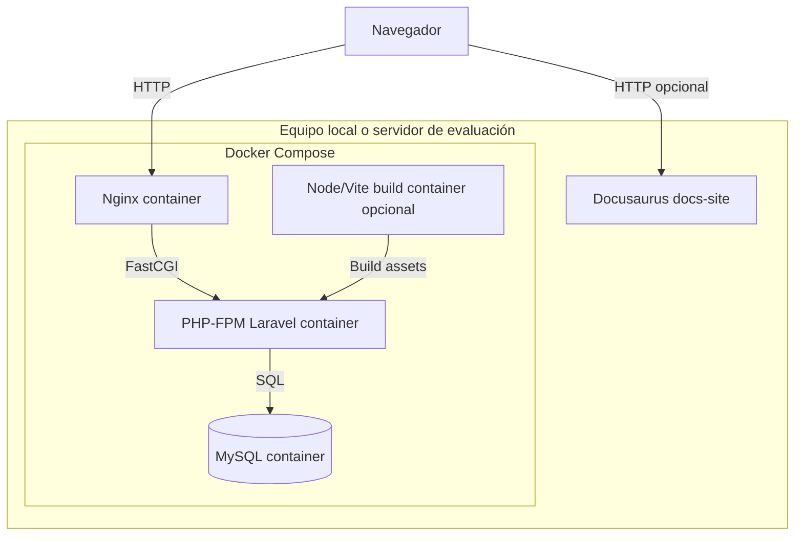

# Diagrama de despliegue

## Notas

- Docker Compose orquesta los servicios principales.
- MySQL usa volumen persistente.
- Nginx sirve `public/` y delega PHP a `app`.
- Los assets se compilan con Vite dentro del proyecto Laravel.
- Docusaurus puede ejecutarse desde `docs-site` para consultar documentación.

