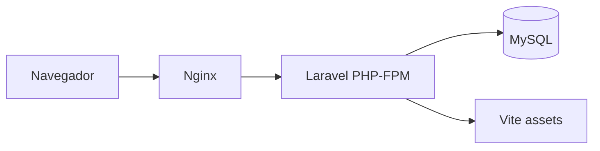

# Arquitectura Docker

## Servicios

La solución debe ejecutarse con Docker Compose y separar responsabilidades mínimas:

- `app`: contenedor PHP 8.4 con Laravel y PHP-FPM.
- `nginx`: servidor HTTP que expone la aplicación.
- `mysql`: base de datos MySQL.
- `node`: opcional para instalar dependencias y compilar assets con Vite.

## Flujo de ejecución

## Variables de entorno relevantes

- `APP_ENV`
- `APP_KEY`
- `APP_URL`
- `DB_CONNECTION`
- `DB_HOST`
- `DB_PORT`
- `DB_DATABASE`
- `DB_USERNAME`
- `DB_PASSWORD`
- `JWT_SECRET`
- Variables de sesión de Laravel para el scaffolding web cuando aplique.

## Consideraciones

- MySQL debe persistir datos en un volumen Docker.
- Nginx debe apuntar al directorio público de Laravel.
- El contenedor `app` debe ejecutar Composer.
- Vite debe compilar assets desde el proyecto Laravel, no desde una app separada.
- La documentación debe explicar comandos de instalación, migración, seed y pruebas.
