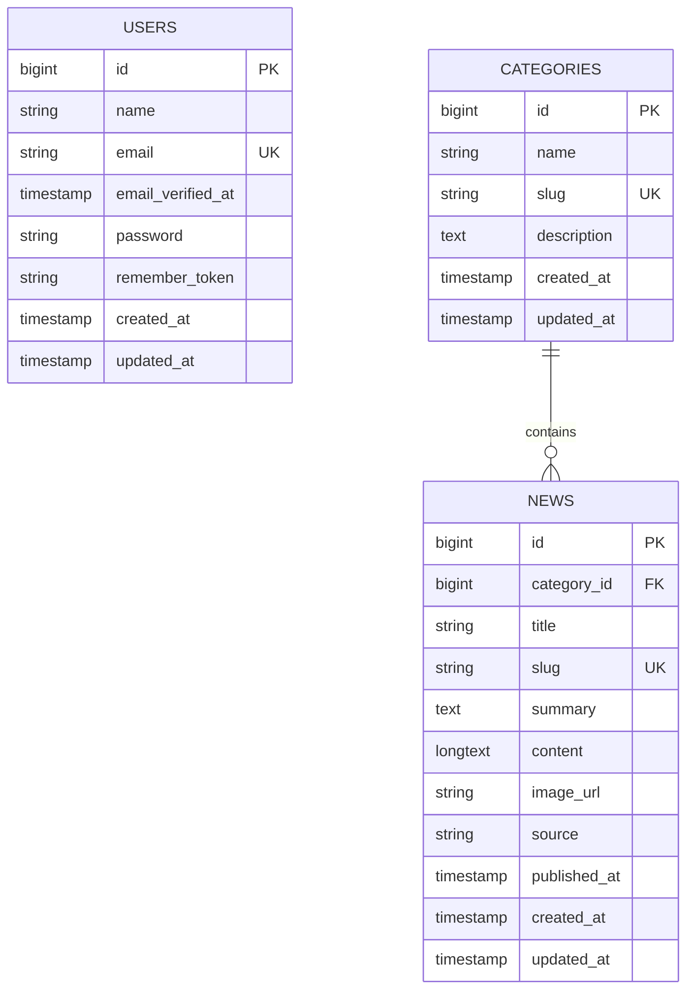

# Diagrama ER final de base de datos

## Revisión aplicada

El backend inicializado contiene las tablas base de Laravel para `users`, cache y jobs. La arquitectura final agrega el dominio de noticias. La autenticación API se resuelve con `JWT` mediante `tymon/jwt-auth`, por lo que no se requiere una tabla de tokens API para el contrato principal.

## Entidades finales

- `users`: usuarios registrados y autenticables.
- `categories`: categorías de noticias.
- `news`: noticias publicadas.

Las tablas técnicas de Laravel como `cache`, `cache_locks`, `jobs`, `job_batches` y `failed_jobs` pueden existir por soporte de framework, pero no forman parte del dominio funcional de noticias.

## Diagrama ER final

## Reglas de integridad

- `users.email` debe ser único.
- `categories.slug` debe ser único.
- `news.slug` debe ser único.
- `news.category_id` debe referenciar `categories.id`.
- Una noticia siempre debe pertenecer a una categoría.
- Las recomendaciones deben excluir la noticia actual.
- Las recomendaciones deben priorizar noticias de la misma categoría.

## Índices finales

- `users.email`.
- `categories.slug`.
- `news.slug`.
- `news.category_id`.
- `news.published_at`.
