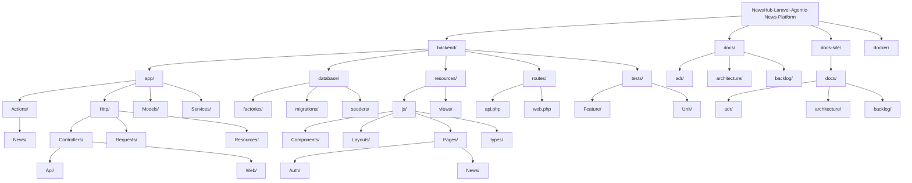

# Estructura del proyecto

## Estructura recomendada

## Reglas de organización

- Las páginas React deben vivir en `resources/js/Pages`.
- Los componentes compartidos deben vivir en `resources/js/Components`.
- Los tipos TypeScript deben vivir en `resources/js/types` o `resources/js/Types`.
- No se debe usar React Router salvo una necesidad explícita.
- No se debe usar Axios para navegación interna de Inertia.
- Las rutas de páginas deben declararse en `routes/web.php`.
- Las rutas JSON deben declararse en `routes/api.php`.
- La lógica de recomendaciones debe vivir en un service o action dedicado.
- La documentación fuente debe mantenerse en `docs`.
- La documentación navegable de Docusaurus debe mantenerse en `docs-site/docs`.

## Separación de responsabilidades

- Controllers: coordinación de requests y responses.
- Form Requests: validación y autorización básica de datos entrantes.
- Services/Actions: reglas de negocio como recomendaciones.
- Models: representación Eloquent del dominio.
- API Resources: transformación estable de respuestas JSON.
- React Pages: pantallas de Inertia.
- React Components: piezas reutilizables de interfaz.
