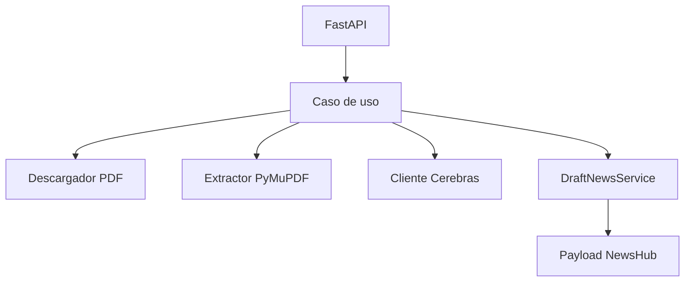

# Arquitectura

`legal-ai-agent` usa Clean Architecture para separar reglas de negocio, casos de uso, infraestructura y API.

## Capas

- `domain`: entidades, interfaces y errores de negocio.
- `application`: DTOs, servicios y casos de uso.
- `infrastructure`: cliente Cerebras, descarga PDF, extraccion de texto y resolucion Legal DCA.
- `presentation`: endpoints FastAPI y schemas HTTP.

## Flujo principal

## Decisiones

- No se escribe directamente en MySQL ni en Laravel.
- La salida es JSON para revision humana en el Admin CMS.
- El cliente IA usa formato compatible con OpenAI.
- La URL interna esperada desde Docker es `http://legal-ai-agent:8000`.
