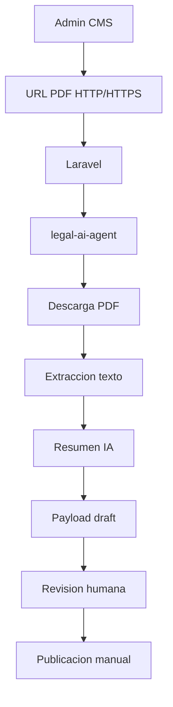

# Flujo Legal AI

## Flujo previsto

## Revision humana obligatoria

El contenido generado por IA es una ayuda de redaccion. No sustituye analisis legal profesional ni verificacion editorial. Todos los resultados incluyen disclaimer y `status = draft`.

## Limitaciones conocidas

- Se soportan URLs HTTP/HTTPS de cualquier dominio.
- La resolucion de PDF desde HTML usa parsing simple con BeautifulSoup.
- No se agrega Playwright porque no se requiere para URLs PDF directas.
- Si el sitio requiere interaccion de navegador para descubrir el PDF, el cliente `LegalDcaClient` esta preparado para extenderse.
- No se envian noticias a Laravel en esta fase.
